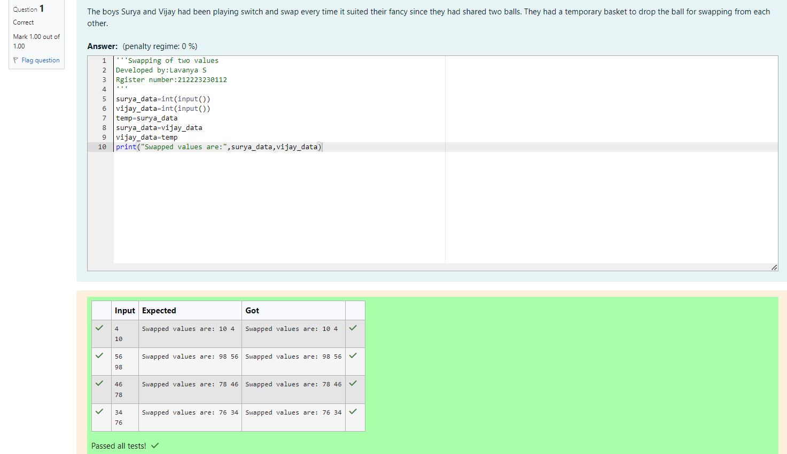

# Swapping-two-values
## AIM:
To write a python program for swapping of two values
## EQUIPEMENT'S REQUIRED: 
PC
Anaconda - Python 3.7
## ALGORITHM: 
### Step 1:
Get the two values from the user
### Step 2: 
Assign the value of second variable to a temporary variable 
### Step 3: 
Assign the value of the first variable to the second variable.
### Step 4:  
Assign the value in temporary variable to the first variable
### Step 5: 
Print both the values it would be interchanged
### Step 6: 
End the program
## PROGRAM:
```
'''Swapping of two values
Developed by:Lavanya S
Rgister number:212223230112
'''
surya_data=int(input())
vijay_data=int(input())
temp=surya_data
surya_data=vijay_data
vijay_data=temp
print("Swapped values are:",surya_data,vijay_data)
```
## OUTPUT:


## RESULT:
Thus the swapping of two values are successfully executed


